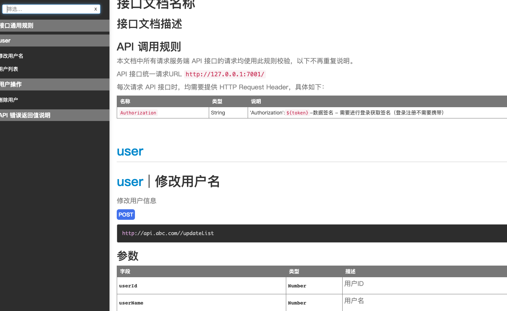
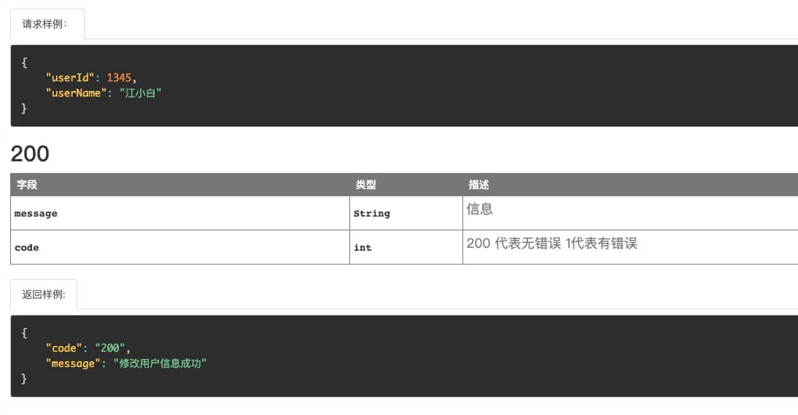

在编写完接口后，需要对接接口，这时候就需要接口文档了，不然别人对接的时候不知道你用的什么字段，每个字段分别表示什么意思。

一个好的文档，能让我们工作起来事半功倍。

这里选择apidoc这个插件。[apidoc官网](https://apidocjs.com/)

## 1、安装apidoc（ps: 这里全局安装，至于为啥，我也不知道，因为我在项目里安装，发现最后找不到apidoc命令，全局安装后却发现是可以的）
```js
npm install apidoc -g
```

## 2、在项目根目录下编写apidoc.json文件，内容如下：
```js
{
  "name": "接口文档名称",
  "version": "1.0.0",
  "description": "接口文档描述",
  "title": "接口文档浏览器标题",
  "url" : "http://api.abc.com/",
  "header": {
    "title": "接口通用规则",
    "filename": "./header.md"
  },
  "footer": {
    "title": "API 错误返回值说明",
    "filename": "./footer.md"
  }
}
```

## 3、编写接口通用规则，在根目录下编写header.md文件，内容如下：
```md
### API 调用规则

本文档中所有请求服务端 API 接口的请求均使用此规则校验，以下不再重复说明。

API 接口统一请求URL ```http://127.0.0.1:7001/```

每次请求 API 接口时，均需要提供 HTTP Request Header，具体如下：
名称 | 类型 | 说明
--- | --- | ---
```Authorization```| String | 'Authorization':`${token}`-数据签名 - 需要进行登录获取签名（登录注册不需要携带）
```

## 4、编写API 错误返回值说明，在根目录下编写footer.md文件，内容如下：
```md
### API 返回值说明

#### 请求返回示例
{
 "code" : 200,
 "message" : "params missing",
 "data" : "Object [NULL | NOT NULL]"
}
#### HTTP 状态码
code | 描述 | 说明
--- | --- | ---
-1 | 错误提交 | 具体看返回的错误信息
200 | 成功提交 | 请求成功，一般用于GET与POSt请求
201 | 成功提交 | [POST/PUT/PATCH]：用户新建或修改数据成功
202 | 成功提交 | 表示一个请求已经进入后台排队（异步任务）
204 | 成功提交 | 用户删除数据成功
301 | 重定向 | 永久重定向
302 | 重定向 | 临时重定向
400 | 请求错误 | [POST/PUT/PATCH]：用户发出的请求有错误
401 | 鉴权失败 | token过期或者不正确，重新登录(账号密码错误)
403 | 访问禁止 | 访问是被禁止的
404 | 路由不存在或者资源不存在 | 访问的url不存在或者对应资源不存在
406 | 请求格式错误 | 用户请求的格式不可得（比如用户请求JSON格式，但是只有XML格式）
407 | 请求数据不存在 | 请求数据不存在
410 | 请求资源被删除 | 用户请求的资源被永久删除，且不会再得到的
500 | 服务器内部错误 | 内部服务器出错
501 | 服务器内部错误 | 服务器不支持请求的功能，无法完成请求
```

## 5、接下来就可以在控制器里入口方法前添加注释说明了，如/app/controller/list.js文件中：
```js
'use strict';

const { Controller } = require('egg');

class ListController extends Controller {
	/**
	* @api {POST} /getList 用户列表
	* @apiGroup user
	* @apiVersion 0.0.1
	* @apiDescription 获取用户列表
	* @apiParam {Number} userId 用户ID
	* @apiParamExample {json} 请求样例：
	* {"userId": 1345}
	* @apiSuccess (200) {String} message 信息
	* @apiSuccess (200) {int} code 200 代表无错误 1代表有错误
	* @apiSuccess (200) {String[]} data 
	* @apiSuccessExample {json} 返回样例:
	* 
		{
			"code":"200",
			"message":"获取用户成功", 
			"data": [
				{
					user_id: 1,          // 用户ID
					user_name: "江小白",  // 用户名
					user_tel: '1934975', // 用户手机号
					status: 1            // 状态，0未完成，1已完成
				},
				{
					user_id: 2, 
					user_name: "小白", 
					user_tel: '1934975', 
					status: 0
				}
			]
		}
	*/
	async getList () {
		const { ctx } = this;
		const userId = ctx.request.body.userId
		const userInfo = await ctx.service.user.find(userId)
		ctx.helper.success({ctx, res: userInfo, message: '请求成功'})
    // ctx.body = userInfo
	}
	/**
	* @api {POST} /updateList 修改用户名
	* @apiGroup user
	* @apiVersion 0.0.1
	* @apiDescription 修改用户信息
	* @apiParam {Number} userId 用户ID
	* @apiParam {Number} userName 用户名
	* @apiParamExample {json} 请求样例：
	* {"userId": 1345, "userName": "江小白"}
	* @apiSuccess (200) {String} message 信息
	* @apiSuccess (200) {int} code 200 代表无错误 1代表有错误
	* @apiSuccessExample {json} 返回样例:
	* {"code":"200","message":"修改用户信息成功"}
	*/
	async updateList () {
		const { ctx } = this;
		const userId = ctx.request.body.userId
		const userName = ctx.request.body.userName
		const userInfo = await ctx.service.user.update(userId, userName)
		if (userInfo.status === 200) {
			ctx.helper.success({ctx, res: userInfo, message: '请求成功'})
		} else {
			ctx.helper.error({ctx, message: '更新数据失败'})
		}
		
	}
	/**
	* @api {POST} /delete 删除用户
	* @apiGroup 用户操作
	* @apiVersion 0.0.1
	* @apiDescription 删除用户
	* @apiParam {Number} userId 用户ID
	* @apiParamExample {json} 请求样例：
	* {"userId": 1345}
	* @apiSuccess (200) {String} message 信息
	* @apiSuccess (200) {int} code 200 代表无错误 1代表有错误
	* @apiSuccessExample {json} 返回样例:
	* {"code":"200","message":"删除用户成功"}
	*/
	async delete () {
		const { ctx } = this;
		const userId = ctx.request.body.userId
		const userInfo = await ctx.service.user.delete(userId)
		if (userInfo.status === 200) {
			ctx.helper.success({ctx, res: userInfo, message: '删除数据成功'})
		} else {
			ctx.helper.error({ctx, message: '删除数据失败'})
		}
    // ctx.helper.success({ctx, res: userInfo, message: '请求成功'})
	}
}

module.exports = ListController;
```

## 6、在项目根目录下运行如下命令：
```js
apidoc -i app/ -o apidoc/
```
读取app目录下controller控制器里的注释，输出到根目录下的apidoc文件夹下，在该文件夹中打开index.html文件即可查看接口文档了。

